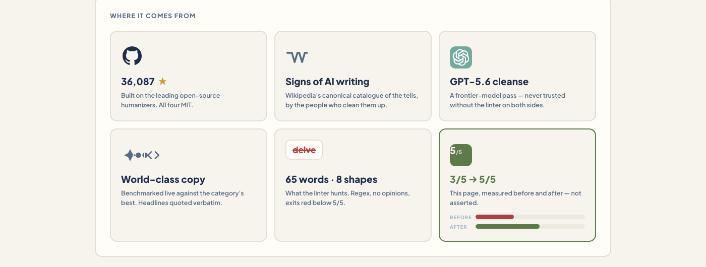
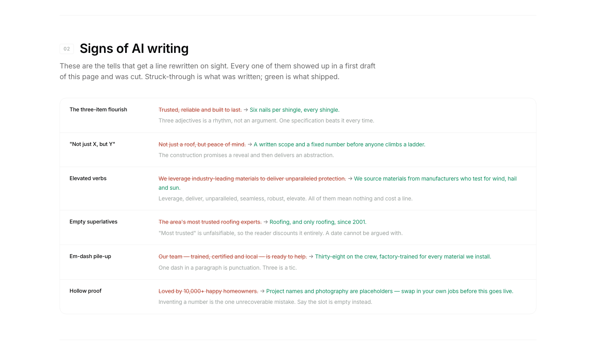
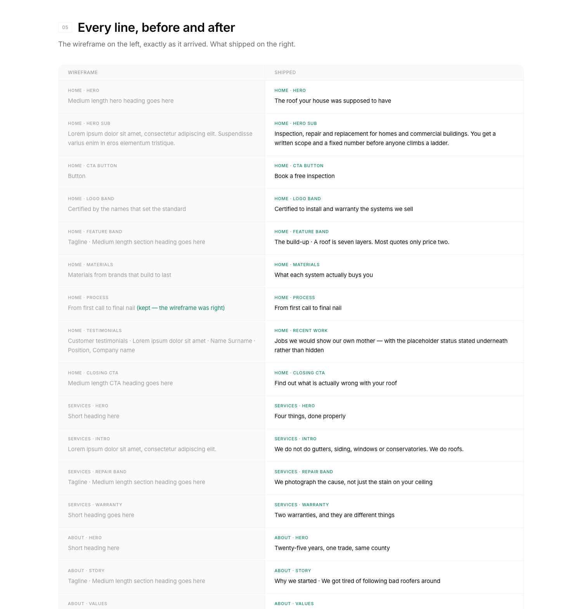

# SlopMonster

**Turn AI-written copy into copy a human would ship.**

Every serious humanizer is built on the same public research. This one adds the two
things the others skip: a linter that can actually **fail** you, and a cleanse pass run
by a **rival model** — because a model cannot hear its own accent.

Built for landing pages, READMEs, emails, scripts — anything a human is going to read
and judge.



## The loop

```
1. LINT      tools/deslop.py     scores /5, exits red below 5. Regex, no opinions.
2. REWRITE   three passes        kill the vocabulary → kill the shapes → put a person back in
3. CLEANSE   tools/cleanse.sh    a different model family strips the tells the first one wrote
4. RE-LINT   tools/deslop.py     ship only at 5/5
```

The linter gets the first and last word because the linter is honest and the model is
persuasive. "Mostly clean" is how a page ends up sounding like every other AI page on
the internet.

## Receipts, not claims

A real run on seven verbatim sentences of Jasper.ai's live homepage (29 Aug 2026):

| | score |
|---|---|
| Their copy, as fetched | **3/5** — `unlock`, `empower`, four rule-of-three lists |
| After one pass through this loop | **5/5** — meaning intact, length within 10%, nothing invented |

Every command and its exact output: [`examples/jasper-live-run.md`](examples/jasper-live-run.md).
Their copy is quoted for criticism and remains theirs; the MIT licence below covers this
repo's own code and prose.

## Quick start

```bash
git clone https://github.com/ItsssssJack/SlopMonster && cd SlopMonster

# score anything
python3 tools/deslop.py --text "It's not just a tool, it's a game-changing journey."
# → score 3/5, names both tells, exits 1

# score a built page (reads only what a visitor can SEE)
python3 tools/deslop.py index.html

# cleanse a draft with a rival model, then re-score
tools/cleanse.sh draft.md > cleansed.md
python3 tools/deslop.py --text "$(cat cleansed.md)"

# your numbers are real and you can evidence them? stop the proof rule blocking the build
python3 tools/deslop.py index.html --allow-proof

# changed a regex? this is what catches a silently half-blind catalogue
python3 tools/test_deslop.py
```

No dependencies. The linter is stdlib Python. The cleanse script needs one AI CLI
(`codex` or `claude`), or neither, in which case it prints the prompt for you to paste.
`.github/workflows/slop.yml` is the build gate, ready to copy into your own repo.

### Install as an agent skill

**Claude Code:** copy this folder to `~/.claude/skills/slopmonster/`, then say `/slopmonster` or
"de-slop this". **Codex / other agents:** point the agent at `SKILL.md` — it is
plain-markdown instructions, nothing Claude-specific.

## The cleanse is model-aware

The rule: the cleanse runs on a **different model family** than the one that wrote the
draft. Different families have different accents, and a model is poor at hearing its own.

| You work in | Draft's accent | `cleanse.sh` does |
|---|---|---|
| Claude Code | Anthropic | calls **GPT-5.6** via your `codex` CLI, time-bound, read-only sandbox |
| Codex / ChatGPT | OpenAI | set `DESLOP_WRITER=gpt` and it calls **Claude** via `claude -p` |
| Gemini CLI | Google | whichever rival CLI is installed |
| no rival CLI | n/a | prints the full prompt to paste into the other family's chat |

It refuses to route a draft back to its own family. A model marking its own homework is
the one thing this step exists to prevent.

Then it re-lints, always: a frontier model is very good at removing tells and quite
capable of adding new ones while it does.

## What the linter hunts

Five groups, one point each. Full catalogue with fixes:
[`references/signs-of-ai-writing.md`](references/signs-of-ai-writing.md).



1. **AI vocabulary** — `delve`, `seamless`, `robust`, `unlock`, `elevate`, `leverage`,
   `journey`, `realm`… two tiers, matched by root, so `elevates` and `elevating` fire too.
   Words with an ordinary literal sense (`crafted`, `harness`, `landscape`) are matched
   exactly instead, so "we craft furniture by hand" stays clean.
2. **AI constructions** — "not just X, but Y" (the single loudest tell in English right
   now), "that's where X comes in", "say goodbye to", hedge stacks, throat-clearing
   openers, self-answering questions… 17 shapes, contracted and uncontracted.
3. **Punctuation cadence** — two em-dashes in one sentence, semicolons in web copy.
4. **Rule-of-three rhythm** — *faster, smarter, and better.* One tricolon is rhetoric;
   three on a page is a machine.
5. **Invented proof** — number-plus-noun patterns ("10,000+ happy users"). Deliberately
   noisy: a false positive costs ten seconds, a false negative is a claim you cannot back.
   It sees a number beside a noun, not whether you can evidence it, so a true claim you
   can defend passes with `--allow-proof` — the hits still print.

## What goes in the tells' place


Clean is not the same as good. Five principles decide what the line says instead —
Krug's *Don't Make Me Think*, Priestley's problem-first pitch order, and the
specificity-over-superlatives argument Hormozi makes from the offer side. Each with a
real before/after: [`references/principles.md`](references/principles.md).

## A full worked example

The Ridgeline Roofing build: a Lorem-ipsum wireframe to a shipped site, with every
headline's before → after, the six tells caught in first drafts, and the verify-or-mark
pass on every number. This is the file that teaches:
[`examples/ridgeline-roofing.md`](examples/ridgeline-roofing.md).



> ~~The area's most trusted roofing experts.~~
> **Roofing, and only roofing, since 2001.**
> "Most trusted" is unfalsifiable, so the reader discounts it entirely. A date cannot be argued with.

## The one hard rule

**Never invent proof.** No user counts, no testimonials, no ratings you have not earned.
If a claim needs a number you do not have, write `[needs number]` and move on. The lift
from a fabricated number is smaller than the lift from real specificity, and it is the
one mistake with no route back.

And this skill will never claim to "beat AI detectors". Detectors are noise. The target
is a human reader's gut.

Before you try it: this README scores 0/5 on its own linter, because it quotes every tell
it documents. `delve`, "not just X, but Y" and "10,000+ happy users" are all on this page
on purpose. Run it on your copy, not on the catalogue describing your copy.

## What this is built on

All sources named in [`references/sources.md`](references/sources.md):
Wikipedia's *Signs of AI writing* (WikiProject AI Cleanup) as the canonical catalogue,
plus four MIT-licensed open-source humanizers: `blader/humanizer`,
`harshaneel/humanize`, `lguz/humanize-writing-skill`, `haidrrrry/humanize-ai-writing`.
The rewrite principles come from Krug, Priestley and Hormozi. Detector-bypass repos are
deliberately excluded.

## Repo map

```
SKILL.md                            the agent skill — the whole loop as instructions
tools/deslop.py                     the linter. stdlib, no deps, exits red below 5/5
tools/test_deslop.py                regression suite. run it after touching any regex
tools/cleanse.sh                    rival-model cleanse, auto-routed, time-bound
.github/workflows/slop.yml          the build gate, ready to copy
prompts/cleanse.txt                 the exact instruction the cleanse model gets
references/signs-of-ai-writing.md   the full catalogue: 2 vocab tiers, 8 shapes, cadence, rhythm, proof
references/principles.md            the five rewrite principles, each with a real pair
references/sources.md               every source this stands on
examples/ridgeline-roofing.md       full site build, every line before → after
examples/jasper-live-run.md         unedited live run: 3/5 → 5/5 on a real page
```

MIT. Same as the humanizers it stands on.
